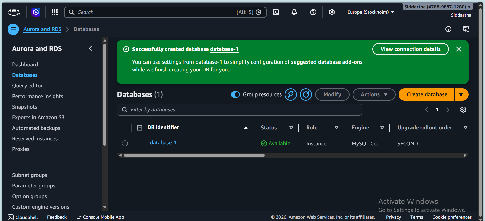

# Multi-Tier Web Application using EC2 & RDS

## Overview
This project demonstrates deploying a simple web-appilication form on AWS using:
- EC2 as VM
- RDS for the database
- Apache2 for serving content

## Architecture

## Setup
See [commands.sh](./commands.sh) for step-by-step installation and configuration.

## Project Screenshots

Step 1: Create an EC2 Instance, on AWS Console;
        1. Login to AWS Console and create a new EC2 instance with Ubuntu 24.04 LTS.
        2. Configure security Groups to allow inbound traffic on ports 22(SSH) or Allow All Traffic (php web application)

Step 2: Create a RDS Database with mysql Engine.
         1. Create a RDS Database Instance on tier, setup database name, user name, and password.
          

)

Step 3: Run these commands on EC2 Terminal

Steo 4: Finally output of web-page on browser

Step 5: Finally output on EC2 Terminal, after you gave input on web-form.

## Future Enhancements
- Add load balancer
- Enable HTTPS with SSL
- Auto-scaling group
=======
# Fresh Start
>>>>>>> 6d7a3845ad8a6b1a5b4c28ffb744a874dd584fbf
